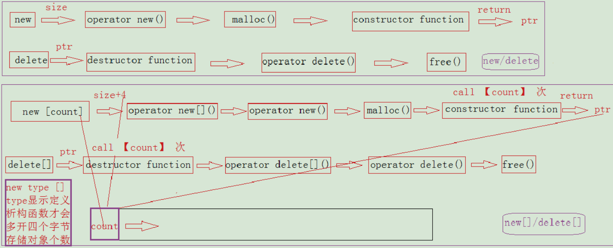

# 堆内存管理

## new 和 malloc 的区别

参考[实习面经 --C/C++ 基础](http://leungyukshing.cn/archives/Interview-C-basic.html)。

**最本质区别** ：new 是运算符（operator），而 malloc 是函数（function）。

- 分配内存的区域
  - new：从自由存储区（free store）中分配内存，自由存储区可以是堆（heap），也可以是静态存储区（static area）
  - malloc：只能从堆（heap）中分配内存
- 返回类型的安全性
  - new：返回对象类型的指针，类型严格与对象匹配，类型安全
  - malloc：返回 `void*`，要强制类型转换
- 内存分配失败
  - new：抛出 `bac_alloc` 异常，不会返回 NULL
  - malloc：返回 NULL，需要用户做判断
- 指定内存大小
  - new：用户不需要制定内存块的大小，编译器会根据类型信息自行计算
  - malloc：用户需要显式地指出所需内存的尺寸
- 构造和析构
  - new 操作符：
    1. 调用 `operator new ()` 函数，分配内存空间
    2. 调用对象构造函数，传入初值
    3. 返回指向该对象的指针
  - delete 操作符：
    1. 调用对象的析构函数
    2. 调用 `operator delete ()` 函数，释放内存空间
  - malloc 函数：只分配内存空间，返回 `void*`
  - free 函数：只释放内存空间
- 支持数组
  - new、delete 支持数组格式，会对数组中每一个对象进行构造或析构
  - malloc、free 不支持构造或析构
- new，malloc 调用
  - new 的实现可基于 malloc
- 重载
  - new、delete：可重载
  - malloc、free：不可重载
- 重新分配内存
  - malloc 分配后，可以用 realloc 进行内存重新分配。先判断当前指针所指向的空间是否有足够的连续空间：
    - 如果有，在原地址的基础上扩大内存地址，返回原指针
    - 如果没有，分配新的空间，将原数据 copy 到新的空间中，然后释放掉原来的空间，返回新地址的指针。

## 堆管理

[brk和sbrk的定义](https://www.cnblogs.com/chengxuyuancc/p/3566710.html)提到`brk`和`sbrk`的用法、堆管理等。

## malloc实现原理

- [ptmalloc源代码分析](./ptmalloc源代码分析.pdf)
- [理解 glibc malloc：主流用户态内存分配器实现原理](https://blog.csdn.net/maokelong95/article/details/51989081#51_Fast_Bin_365)
- [聊聊glibc ptmalloc内存管理哪些事儿](https://yangrz.github.io/blog/2017/12/20/ptmalloc/)
- [C/C++:堆栈面面观](https://zhuanlan.zhihu.com/p/56929325)
- [使用malloc测试堆的最大申请数量](https://www.jianshu.com/p/43567f4ea4eb)
- [深入理解内存分配](http://djs66256.github.io/2018/04/04/2018-04-04-%E6%B7%B1%E5%85%A5%E7%90%86%E8%A7%A3%E5%86%85%E5%AD%98%E5%88%86%E9%85%8D/)

## 伙伴系统、slab机制

- [Linux中的伙伴系统和slab机制](https://glemontree.github.io/2017/10/23/[Linux]%20Linux%E4%B8%AD%E7%9A%84%E4%BC%99%E4%BC%B4%E7%B3%BB%E7%BB%9F%E5%92%8Cslab%E6%9C%BA%E5%88%B6/)
- [内核页表和linux的伙伴系统是不是有冲突？](https://www.zhihu.com/question/52711172)
- [浅谈Linux内存管理那些事儿](https://mp.weixin.qq.com/s/tqNluv-PvDi2GCXnrJCfIA)

## new的过程

- [c++ 中new 操作符是怎么实现的](https://segmentfault.com/q/1010000000160483)
- [new/delete、malloc/free底层实现剖析和区别](https://blog.csdn.net/ZWE7616175/article/details/80330800)
- [C++ 内存分配(new，operator new)详解](https://www.cnblogs.com/yyxt/p/4256985.html)
- [C++中内存管理之new/delete](https://jacktang816.github.io/post/cppnewdelete/#new-delete%E7%9A%84%E5%AE%9E%E7%8E%B0%E6%9C%BA%E5%88%B6)
- [set_new_handler](https://www.jianshu.com/p/179f3006e20d)
- [std::set_new_handler](https://zh.cppreference.com/w/cpp/memory/new/set_new_handler)
- [C++ 的 new 关键字深入理解](http://www.codeceo.com/article/cpp-new-keyword.html)
- [C++中的new和delete真的复杂吗？(上)](https://www.jianshu.com/p/8239fba221ab)
- [C++中的new和delete真的复杂吗？(下)](https://www.jianshu.com/p/06d8bed7fab0)

## delete this 合法吗？

合法，但：

1. 必须保证 this 对象是通过 `new`（不是 `new[]`、不是 `placement new`、不是栈上、不是全局、不是其他对象成员）分配的；
2. 必须保证调用 `delete this` 的成员函数是最后一个调用 this 的成员函数；
3. 必须保证成员函数的 `delete this` 后面没有调用`this`了；
4. 必须保证 `delete this` 后没有人使用了。