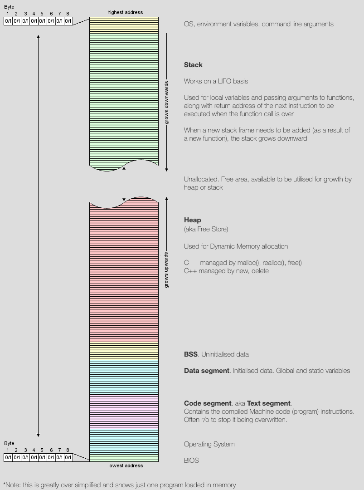

# C++内存相关

本篇介绍了 C++ 内存相关的知识。

## C++内存分区

在C++中，内存分成5个区，他们分别是堆、栈、自由存储区、全局/静态存储区和常量存储区。

- **栈**：在执行函数时，函数内局部变量的存储单元都可以在栈上创建，函数执行结束时这些存储单元自动被释放。栈内存分配运算内置于处理器的指令集中，效率很高，但是分配的内存容量有限。
- **堆**：就是那些由 `new`分配的内存块，他们的释放编译器不去管，由我们的应用程序去控制，一般一个`new`就要对应一个 `delete`。如果程序员没有释放掉，那么在程序结束后，操作系统会自动回收。
- **全局/静态存储区**：全局变量和静态变量被分配到同一块内存中。在以前的**C语言**中，**全局变量又分为初始化的和未初始化的**。在C++里面没有这个区分了，他们共同占用同一块内存区。
- **常量存储区**：这是一块比较特殊的存储区，他们里面存放的是常量，不允许修改。
- **代码段**：代码段（code segment / text segment）通常是指用来存放**程序执行代码**的一块内存区域。这部分区域的大小在程序运行前就已经确定，并且内存区域通常属于**只读**, 某些架构也允许代码段为可写，即允许修改程序。在代码段中，也有可能包含一些只读的常数变量，例如字符串常量等。

根据c/c++对象生命周期不同，c/c++的内存模型有三种不同的内存区域，即

- 自由存储区，动态区、静态区。

- 自由存储区：局部非静态变量的存储区域，即平常所说的栈。
- 动态区： 用operator new ，malloc分配的内存，即平常所说的堆。

- 静态区：全局变量 静态变量 字符串常量存在位置。

下图为 C++ 内存模型，来自[C++ Essentials](https://cpp.tech-academy.co.uk/memory-layout/)。

- .text 部分是编译后程序的主体，也就是程序的机器指令。
- .data 和 .bss 保存了程序的全局变量，.data保存有初始化的全局变量，.bss保存只有声明没有初始化的全局变量。
- heap（堆）中保存程序中动态分配的内存，比如C的malloc申请的内存，或者C++中new申请的内存。堆向高地址方向增长。
- stack（栈）用来进行函数调用，保存函数参数，临时变量，返回地址等。
- [共享内存的位置](../../system_programing/shared_memory/shared_memory.md)在堆和栈之间。

更详细的内存段解释见[C与C++内存管理详解](https://www.zdaiot.com/C/%E8%AF%AD%E6%B3%95/C%E4%B8%8EC++%E5%86%85%E5%AD%98%E7%AE%A1%E7%90%86%E8%AF%A6%E8%A7%A3/)。

### C++对象的成员函数存放在内存哪里

类成员函数和非成员函数代码存放在**代码段**。如果类有虚函数，则该类就会存在虚函数表。虚函数表在Linux/Unix中存放在可执行文件的**只读数据段中(rodata)**，即前面起到的**代码段**，而微软的编译器将虚函数表存放在**常量段**。

## 堆和栈的区别

**管理方式**：对于栈来讲，是由编译器自动管理，无需我们手工控制；对于堆来说，释放工作由程序员控制，容易产生`memory leak`。

**空间大小**：一般来讲在32位系统下，堆内存可以达到4G的空间，从这个角度来看堆内存几乎是没有什么限制的。但是对于栈来讲，一般都是有一定的空间大小的。

**碎片问题**：对于堆来讲，频繁的`new/delete`势必会造成内存空间的不连续，从而造成大量的碎片，使程序效率降低。对于栈来讲，则不会存在这个问题，因为栈是先进后出的队列，它们是如此的一一对应，以至于永远都不可能有一个内存块从栈中间弹出，在他弹出之前，在他上面的后进的栈内容已经被弹出。

**生长方向**：对于堆来讲，生长方向是向上的，也就是向着内存地址增加的方向；对于栈来讲，它的生长方向是向下的，是向着内存地址减小的方向增长。

**分配方式**：堆都是动态分配的，没有静态分配的堆。栈有2种分配方式：静态分配和动态分配。静态分配是编译器完成的，比如局部变量的分配。动态分配由`alloca`函数进行分配，但是栈的动态分配和堆是不同的，他的动态分配是由编译器进行释放，无需我们手工实现。

**分配效率**：栈是机器系统提供的数据结构，计算机会在底层对栈提供支持：分配专门的寄存器存放栈的地址，压栈出栈都有专门的指令执行，这就决定了栈的效率比较高。堆则是C/C++函数库提供的，它的机制是很复杂的，例如为了分配一块内存，库函数会按照一定的算法（具体的算法可以参考数据结构/操作系统）在堆内存中搜索可用的足够大小的空间，如果没有足够大小的空间（可能是由于内存碎片太多），就有可能调用系统功能去增加程序数据段的内存空间，这样就有机会分到足够大小的内存，然后进行返回。显然，堆的效率比栈要低得多。

从这里我们可以看到，堆和栈相比，由于大量`new/delete`的使用，容易造成大量的内存碎片；由于没有专门的系统支持，效率很低；由于可能引发用户态和核心态的切换，内存的申请，代价变得更加昂贵。所以栈在程序中是应用最广泛的，就算是函数的调用也利用栈去完成，函数调用过程中的参数，返回地址，EBP和局部变量都采用栈的方式存放。所以，我们推荐大家尽量用栈，而不是用堆。

虽然栈有如此众多的好处，但是由于和堆相比不是那么灵活，有时候分配大量的内存空间，还是用堆好一些。

## “野指针”

“野指针”不是`NULL`指针，是指向“垃圾”内存的指针。“野指针”的成因主要有三种：

1. 指针变量没有被初始化，缺省值是随机的；
2. 指针被`free/delete`之后，没有置为`NULL`，让人误以为该指针是个合法的指针；
3. 指针操作超越了变量的作用域范围（内存越界）。

## 有了malloc/free为什么还要new/delete

`malloc`与`free`是C++/C语言的标准库函数，`new/delete`是C++的运算符。它们都可用于申请动态内存和释放内存。

对于非内部数据类型的对象而言，光用`maloc/free`无法满足动态对象的要求。**对象在创建的同时要自动执行构造函数，对象在消亡之前要自动执行析构函数。***由于`malloc/free`是库函数而不是运算符，不在编译器控制权限之内，不能够把执行构造函数和析构函数的任务强加于`malloc/free`。因此 C++ 语言需要一个能完成动态内存分配和初始化工作的运算符`new`，以及一个能完成清理与释放内存工作的运算符`delete`。

既然`new/delete`的功能完全覆盖了`malloc/free`，为什么C++不把`malloc/free`淘汰出局呢？这是因为C++程序经常要调用C函数，而**C程序只能用`malloc/free`管理动态内存**。

如果用`free`释放“new创建的动态对象”，那么该对象因**无法执行析构函数**而可能导致程序出错。如果用`delete`释放“malloc申请的动态内存”，结果也会导致**程序出错**，该程序的可读性也很差。所以`new/delete`必须配对使用，`malloc/free`也一样。

## alloca

`man`中的介绍：

> The alloca() function allocates size bytes of space in the stack frame of the caller.  This temporary space is automatically freed when the function that called alloca() returns to its caller.

`alloca`是从栈中分配空间。正因其从栈中分配的内存，因此无需手动释放内存。

讨论见[stackoverflow](https://stackoverflow.com/questions/1018853/why-is-the-use-of-alloca-not-considered-good-practice)。

## 内存崩溃

| **错误类型** | **原因**                                                     | **备注**                          |
| ------------ | ------------------------------------------------------------ | --------------------------------- |
| 声明错误     | 变量未声明                                                   | 编译时错误                        |
| 初始化错误   | 未初始化或初始化错误                                         | 运行不正确                        |
| 访问错误     | 1. 数组索引访问越界 2. 指针对象访问越界 3. 访问空指针对象 4. 访问无效指针对象 5. 迭代器访问越界 |                                   |
| 内存泄漏     | 1. 内存未释放 2. 内存局部释放                            |                                   |
| 参数错误     | 本地代理、空指针、强制转换                                   |                                   |
| 堆栈溢出     | 1. 递归调用 2. 循环调用 3. 消息循环 4.大对象参数 5. 大对象变量 | 参数、局部变量都在栈(Stack)上分配 |
| 转换错误     | 有符号类型和无符号类型转换                                   |                                   |
| 内存碎片     | 小内存块重复分配释放导致的内存碎片，最后出现内存不足         | 数据对齐，机器字整数倍分配        |

其它如**内存分配失败**、**创建对象失败**等都是容易理解和相对少见的错误，因为目前的系统大部分情况下内存够用；此外**除 0 错误**也是容易理解和防范。

## C++内存泄漏的几种情况

**1. 在类的构造函数和析构函数中没有匹配的调用new和delete函数**

> 两种情况下会出现这种内存泄露：一是在堆里创建了对象占用了内存，但是没有显示地释放对象占用的内存；二是在类的构造函数中动态的分配了内存，但是在析构函数中没有释放内存或者没有正确的释放内存

**2. 没有正确地清除嵌套的对象指针**

**3. 在释放对象数组时在delete中没有使用方括号**

> 方括号是告诉编译器这个指针指向的是一个对象数组，同时也告诉编译器正确的对象地址值病调用对象的析构函数，如果没有方括号，那么这个指针就被默认为只指向一个对象，对象数组中的其他对象的析构函数就不会被调用，结果造成了内存泄露。如果在方括号中间放了一个比对象数组大小还大的数字，那么编译器就会调用无效对象（内存溢出）的析构函数，会造成堆的奔溃。如果方括号中间的数字值比对象数组的大小小的话，编译器就不能调用足够多个析构函数，结果会造成内存泄露。
>
> 释放单个对象、单个基本数据类型的变量或者是基本数据类型的数组不需要大小参数，释放定义了析构函数的对象数组才需要大小参数。

**4. 指向对象的指针数组不等同于对象数组**

> 对象数组是指：数组中存放的是对象，只需要`delete []p`，即可调用对象数组中的每个对象的析构函数释放空间
>
> 指向对象的指针数组是指：数组中存放的是指向对象的指针，不仅要释放每个对象的空间，还要释放每个指针的空间，`delete []p`只是释放了每个指针，但是并没有释放对象的空间，正确的做法，是通过一个循环，将每个对象释放了，然后再把指针释放了

**5. 缺少拷贝构造函数**

> 两次释放相同的内存是一种错误的做法，同时可能会造成堆的奔溃。
>
> 按值传递会调用（拷贝）构造函数，引用传递不会调用。
>
> 在C++中，如果没有定义拷贝构造函数，那么编译器就会调用默认的拷贝构造函数，会逐个成员拷贝的方式来复制数据成员，如果是以逐个成员拷贝的方式来复制指针被定义为将一个变量的地址赋给另一个变量。这种隐式的指针复制结果就是两个对象拥有指向同一个动态分配的内存空间的指针。当释放第一个对象的时候，它的析构函数就会释放与该对象有关的动态分配的内存空间。而释放第二个对象的时候，它的析构函数会释放相同的内存，这样是错误的。
>
> 所以，如果一个类里面有指针成员变量，要么必须显示的写拷贝构造函数和重载赋值运算符，要么禁用拷贝构造函数和重载赋值运算符。

**6. 缺少重载赋值运算符**

> 这种问题跟上述问题类似，也是逐个成员拷贝的方式复制对象，如果这个类的大小是可变的，那么结果就是造成内存泄露，如下图:
>
> 

**7. 关于nonmodifying运算符重载的常见迷思**

> a. 返回栈上对象的引用或者指针（也即返回局部对象的引用或者指针）。导致最后返回的是一个空引用或者空指针，因此变成野指针。
>
> b. 返回内部静态对象的引用。
>
> c. 返回一个泄露内存的动态分配的对象。导致内存泄露，并且无法回收。
>
> 解决这一类问题的办法是重载运算符函数的返回值不是类型的引用，二应该是类型的返回值，即不是 int&而是`int`。

**8. 没有将基类的析构函数定义为虚函数**

> 当基类指针指向子类对象时，如果基类的析构函数不是`virtual`，那么子类的析构函数将不会被调用，子类的资源没有正确是释放，因此造成内存泄露。
>
>  

**9. 野指针：指向被释放的或者访问受限内存的指针**

> 造成野指针的原因：
>
> 1. 指针变量没有被初始化（如果值不定，可以初始化为`NULL`）。
>
> 2. 指针被`free`或者`delete`后，没有置为`NULL`，`free` 和`delete`只是把指针所指向的内存给释放掉，并没有把指针本身干掉，此时指针指向的是“垃圾”内存。释放后的指针应该被置为`NULL`。
>
> 3. 指针操作超越了变量的作用范围，比如返回指向栈内存的指针就是野指针。

## 内存对齐

- [为什么要内存对齐](https://zhuanlan.zhihu.com/p/33252691)
- [C/C++ 各数据类型占用字节数](https://zhuanlan.zhihu.com/p/93583960)
- [C/C++ 结构体字节对齐](https://www.sczyh30.com/posts/Summary/struct_sizeof/)
- [C/C++内存对齐](https://songlee24.github.io/2014/09/20/memory-alignment/)

## 参考

- [C++ Essentials](https://cpp.tech-academy.co.uk/memory-layout/)

- [C和C++内存模型](https://www.cnblogs.com/Stultz-Lee/p/6751522.html)

- [C与C++内存管理详解](https://www.zdaiot.com/C/%E8%AF%AD%E6%B3%95/C%E4%B8%8EC++%E5%86%85%E5%AD%98%E7%AE%A1%E7%90%86%E8%AF%A6%E8%A7%A3/)

- [C++ 常见崩溃问题分析](https://www.cnblogs.com/zhoug2020/p/6025388.html)

- [C++虚函数表](https://www.dazhuanlan.com/2019/12/07/5deb312988a07/)

- [虚函数表在对象内存中的布局](https://www.jianshu.com/p/56dc9231641c)
- [C++内存泄漏的几种情况](https://www.cnblogs.com/SeekHit/p/6549940.html)