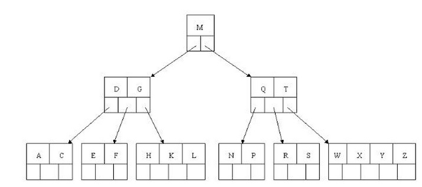
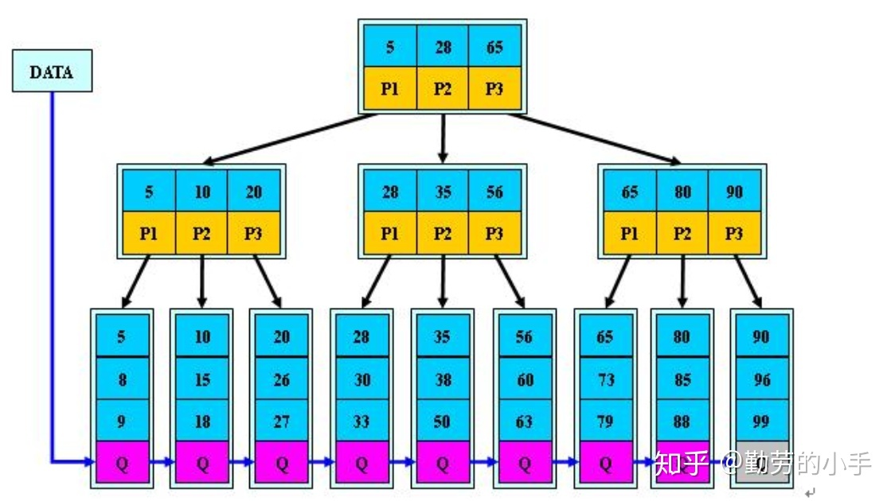

## 平衡二叉树
### 特点
1. 非叶子节点最多拥有两个子节点；

2. 非叶子节值大于左边子节点、小于右边子节点；

3. **树的左右子树的高度相差不会大于1;**

4. 没有值相等重复的节点。

## B树(B-Tree)
### 概念
B树和平衡二叉树稍有不同的是B树属于多叉树又名**平衡多路查找树**（查找路径不只两个），数据库索引技术里大量使用者B树和B+树的数据结构。
### 数据库索引为什么采用B树/B+树结构？（为了减少磁盘IO）
数据库索引存储在磁盘上，当数据库的数据量比较大时，索引可能高达几G，甚至更多。所以在利用索引查找时，不会一次性把整个索引加载到内存，而是每次只加载一个磁盘页（这里的磁盘页对应索引树的节点）。

1. 若索引树采用二叉树结构，则一个页面只能存放一个值。因此在最坏的情况下，查找一个值的磁盘IO次数 = 索引树的高度。
2. 由1可看出，磁盘IO次数由索引树的高度决定。因此，为了减少磁盘IO次数，需要把原本“瘦高”的树结构转变成“矮胖”的树结构。B树和B+树就是这样一种数据结构。对于B树和B+树，每个节点包含的关键字数目取决于磁盘页的大小。

### B树的规则
m阶代表一个树节点最多有多少个查找路径。
1. 若根节点不是叶子节点，则 2 <= 根节点的孩子数 <= m；（根节点至少包含一个关键字）
2. 除根节点和叶子节点外（枝节点），ceil(m/2) <= 枝节点的孩子数 <= m，其包含的关键字数 = 孩子数-1；
3. 所有叶子节点都出现在同一层，ceil(m/2)-1 <= 叶节点包含的关键字数目 <= m - 1；
4. 每个节点中的关键字从小到大排列，并且非叶子节点的k-1个关键字，正好是它k个孩子包含的关键字的值域分划（即，父节点中的第i个关键字（如果存在的话） < 第i个孩子中的所有关键字 < 父节点中的第i+1个关键字（如果存在的话）。

### B树的查询
如上图我要从上图中找到E字母，查找流程如下

1. 获取根节点的关键字进行比较，当前根节点关键字为M，E<M（26个字母顺序），所以往找到指向左边的子节点（二分法规则，左小右大，左边放小于当前节点值的子节点、右边放大于当前节点值的子节点）；

2. 拿到关键字D和G，D<E<G 所以直接找到D和G中间的节点；

3. 拿到E和F，因为E=E，所以直接返回关键字和指针信息（如果树结构里面没有包含所要查找的节点则返回null）。

**遵循规则：**

1. 节点拆分规则：当前是要组成一个5路查找树，那么此时m=5,关键字数必须<=5-1（这里关键字数>4就要进行节点拆分）；

2. 排序规则：满足节点本身比左边节点大，比右边节点小的排序规则;

先插入 3、8、31、11

### B树的特点
B树相对于平衡二叉树的不同是，每个节点包含的关键字增多了，特别是在B树应用到数据库中的时候，数据库充分利用了磁盘块的原理（磁盘数据存储是采用块的形式存储的，每个块的大小为4K，每次IO进行数据读取时，同一个磁盘块的数据可以一次性读取出来）把节点大小限制和充分使用在磁盘快大小范围；把树的节点关键字增多后树的层级比原来的二叉树少了，减少数据查找的次数和复杂度。

## B+树

### 概念
B+树是B树的一个升级版，相对于B树来说B+树更充分的利用了节点的空间，让查询速度更加稳定，其速度完全接近于二分法查找。为什么说B+树查找的效率要比B树更高、更稳定；我们先看看两者的区别。

### 规则
1. B+跟B树不同B+树的**非叶子节点不保存关键字记录的指针**，只进行数据索引，这样使得B+树每个非叶子节点所能保存的关键字大大增加；

2. B+树**叶子节点保存了父节点的所有关键字记录的指针**，所有数据地址必须要到叶子节点才能获取到。所以每次数据查询的次数都一样；

3. B+树叶子节点的关键字从小到大有序排列，左边结尾数据都会保存右边节点开始数据的指针。

4. 非叶子节点的子节点数=关键字数（来源百度百科）（根据各种资料 这里有两种算法的实现方式，另一种为非叶节点的关键字数=子节点数-1（来源维基百科)，虽然他们数据排列结构不一样，但其原理还是一样的Mysql 的B+树是用第一种方式实现）。

### B+树的特点

1. **B+树的层级更少**：相较于B树B+每个非叶子节点存储的关键字数更多，树的层级更少所以查询数据更快；

2. **B+树查询速度更稳定**：B+所有关键字数据地址都存在叶子节点上，所以每次查找的次数都相同所以查询速度要比B树更稳定;

3. **B+树天然具备排序功能**：B+树所有的叶子节点数据构成了一个有序链表，在查询大小区间的数据时候更方便，数据紧密性很高，缓存的命中率也会比B树高。

4. **B+树全节点遍历更快**：B+树遍历整棵树只需要遍历所有的叶子节点即可，而不需要像B树一样需要对每一层进行遍历，这有利于数据库做全表扫描。

B树相对于B+树的优点是，如果经常访问的数据离根节点很近，而B树的非叶子节点本身存有关键字其数据的地址，所以这种数据检索的时候会要比B+树快。

