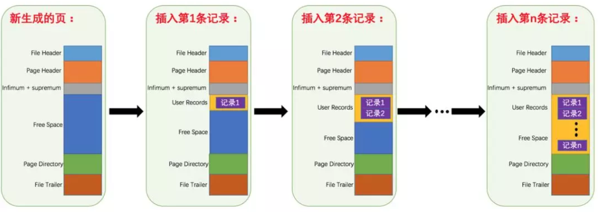
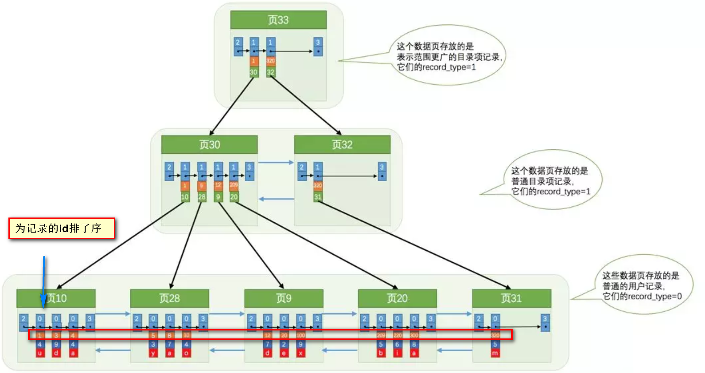
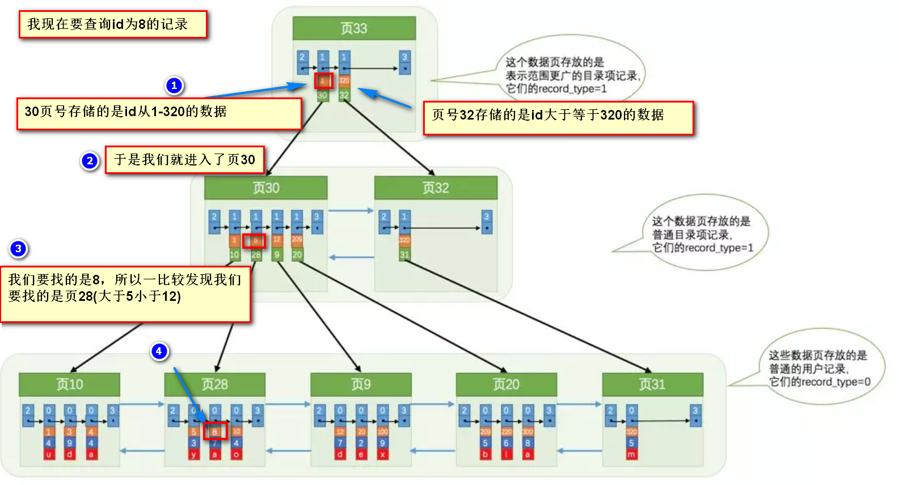
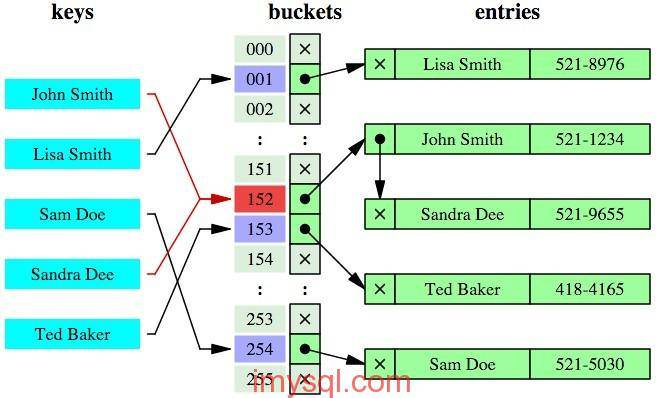

## MySQL 的基本存储结构

* 各个**数据页**可以组成一个**双向链表**
* 每个**数据页中的记录**又可以组成一个**单向链表**

    * 每个数据页都会为存储在它里面的记录生成一个**页目录**，在通过**主键**查找某条记录的时候可以在页目录中使用二分法快速定位到对应的槽，然后再遍历该槽对应分组中的记录即可快速找到指定的记录
    * 以其他列(非主键)作为搜索条件：只能从最小记录开始依次遍历单链表中的每条记录。

所以，如果我们写`select * from user where username = 'Java3y'`这样没有进行任何优化的sql语句，默认会这样做：
* 定位到记录所在的页。
    * 需要遍历双向链表，找到所在的页。
* 从所在的页内中查找相应的记录。
    * 由于不是根据主键查询，只能遍历所在页的单链表了。
很明显，在数据量很大的情况下这样查找会**很慢**！

## 索引提高检索速度
索引做了些什么可以让我们查询加快速度呢？
其实就是将无序的数据变成相对有序：

很明显的是：没有用索引我们是需要遍历双向链表来定位对应的页，现在通过逐级查询**目录**就可以很快地定位到对应的页上了！
其实这种目录也叫作**索引**，其底层结构就是**B+树**，B+树作为多路查找平衡树的一种实现，能够让我们很快地查找出对应的记录。

## 索引降低增删改的速度
* B+树是一颗平衡树，如果我们对这颗树增删改的话，那肯定会破坏它的原有结构。
* 要维持平衡树，就必须做额外的工作。正因为这些额外的工作开销，导致索引会降低增删改的速度

## 哈希索引
除了B+树之外，还有一种常见的是哈希索引。
哈希索引就是采用一定的**哈希算法**，把键值换算成新的哈希值，检索时不需要类似B+树那样从根节点到叶子节点逐级查找，只需一次哈希算法即可立刻定位到相应的位置，速度非常快。

* 本质上就是把键值换算成新的哈希值，根据这个哈希值来定位。

看起来哈希索引查询速度很快，但其实哈希索引有好几个局限：

* 哈希索引也没办法利用索引完成**排序**
* 不支持**最左匹配原则**
* 在有大量重复键值情况下，哈希索引的效率也是极低的---->**哈希碰撞**问题。
* 不支持**范围查询**

## 聚集索引和非聚集索引
### 聚集索引
1. 使用记录主键值的大小进行记录和页的排序，这包括三个方面的含义：

* 页内的记录是按照主键的大小顺序排成一个单向链表。

* 各个存放用户记录的页也是根据页中记录的主键大小顺序排成一个双向链表。

* 各个存放目录项的页也是根据页中记录的主键大小顺序排成一个双向链表。

2. B+树的叶子节点存储的是完整的用户记录。

简单来讲：
* 聚集索引就是以**主键**创建的索引。

### 非聚集索引
* 非聚集索引就是以**非主键**创建的索引。

区别：

* 聚集索引在叶子节点存储的是**表中的数据**
* 非聚集索引在叶子节点存储的是**主键和索引列**
* 使用非聚集索引查询出数据时，拿到叶子上的主键**必须再根据主键值去聚集索引中再查找一遍完整的用户记录**(拿到主键再查找这个过程叫做**回表**)。

因此非聚集索引也叫做**二级索引**。

* 创建多个单列(非聚集)索引的时候，会生成多个索引树，所以过多创建索引会占用磁盘空间

## 列的离散性
* 列的离散性在索引中是一种很重要的指标。
* 列的离散性：`x = count(distinct col) / count(col)`
* 比例越大，离散性越高，选择性就越好
下面我们看个例子来理解：

id | name | sex 
---|---|---
1 | 哈登 | 男
2 | 库里 | 男
3 | 詹姆斯 | 男
4 | 伦纳德 | 男
5 | 斯嘉丽 | 女

* name的列的离散性 x1 = 5 / 5 = 1
* sex的列的离散性 x2 = 2 / 5 = 0.4
* x1 > x2，所以sex的列的离散性低，可选择性差。
* 可选择性差是什么意思呢？比如有如上100W的数据，现在我们要查找sex=男的，那么在索引中我们可选择的范围太大了，因为只有男或者女，查询效率就很低
* 在mysql查询优化器中，如果列的离散性低的话，可能就不走索引，直接全表扫描

## 联合索引
### 建立联合索引的原则
* 经常用的列优先
* 离散性高的列优先
* 宽度小的列优先
### 适用性
* 如果不符合最左匹配原则，则无法使用联合索引
* `where id = ? and age > ? `第二列是范围判断的，走联合索引
* `where id > ? and age = ? `第一列是范围判断的，不走联合索引

## 最左匹配原则

索引可以简单如一个列`(a)`，也可以复杂如多个列`(a, b, c, d)`，即联合索引。
如果是联合索引，那么key也由多个列组成，同时，索引只能用于查找key是否存在（相等），遇到范围查询(`>、<、between、like左匹配`)等就不能进一步匹配了，后续退化为线性查找。
因此，列的排列顺序决定了可命中索引的列数。

例子：  

如有索引`(a, b, c, d)`，查询条件`a = 1 and b = 2 and c > 3 and d = 4`，则会在每个节点依次命中a、b、c，无法命中d。(很简单：**索引命中只能是相等的情况，不能是范围匹配**)

## 覆盖索引
* 定义：如果查询的列可以通过索引节点的关键字直接返回，则称之为覆盖索引

* ex: index_name
    * 覆盖：`select name from user where name= ?`
    * 非覆盖：`select * from user where name= ?`

* 覆盖索引可以减少数据库IO操作，不用再拿叶子上的主键去聚集索引查想要查找的数据。

## 建立索引的原则
* 索引不易建多：维护B+树成本高，插入、更新、删除等操作要做很多逻辑判断；
* 索引列的长度不易过长：可以有效减少索引的磁盘占用提高查询效率。

