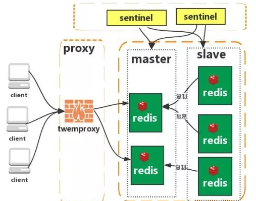

## Redis存储原理（为什么快？）
Redis采用的是基于内存的采用的是单进程单线程模型的 KV 数据库，由C语言编写，官方提供的数据是可以达到100000+的QPS（每秒内查询次数）。

* 完全基于内存，绝大部分请求是纯粹的内存操作，非常快速。它的，数据存在内存中，类似于 HashMap，HashMap 的优势就是查找和操作的时间复杂度都是 O(1)；
* 数据结构简单，对数据操作也简单，Redis中的数据结构是专门进行设计的；
* 采用单线程，避免了不必要的上下文切换和竞争条件，也不存在多进程或者多线程导致的切换而消耗 CPU，不用去考虑各种锁的问题，不存在加锁释放锁操作，没有因为可能出现死锁而导致的性能消耗；
* 使用多路I/O复用模型，非阻塞IO；
* 使用底层模型不同，它们之间底层实现方式以及与客户端之间通信的应用协议不一样，Redis直接自己构建了VM 机制 ，因为一般的系统调用系统函数的话，会浪费一定的时间去移动和请求；

## Redis支持的数据类型
### String字符串

**格式：SET key value**

string类型是二进制安全的。意思是redis的string可以包含任何数据。比如jpg图片或者序列化的对象 。

string类型是Redis最基本的数据类型，一个键最大能存储512MB。

**String**的实际应用场景比较广泛的有

* **缓存功能**：**String**字符串是最常用的数据类型，不仅仅是Redis，各个语言都是最基本类型，因此，利用Redis作为缓存，配合其它数据库作为存储层，利用Redis支持高并发的特点，可以大大加快系统的读写速度、以及降低后端数据库的压力。
* **计数器**：许多系统都会使用Redis作为系统的实时计数器，可以快速实现计数和查询的功能。而且最终的数据结果可以按照特定的时间落地到数据库或者其它存储介质当中进行永久保存。
* **共享用户Session**：用户重新刷新一次界面，可能需要访问一下数据进行重新登录，或者访问页面缓存Cookie，但是可以利用Redis将用户的Session集中管理，在这种模式只需要保证Redis的高可用，每次用户Session的更新和获取都可以快速完成。大大提高效率。


### Hash（哈希）

**格式：hmset name  key1 value1 key2 value2**

Redis hash 是一个键值(key=>value)对集合。

Redis hash是一个string类型的field和value的映射表，hash特别适合用于存储对象。

### List（列表）

Redis 列表是简单字符串列表，按照插入顺序排序。你可以添加一个元素到列表的头部（左边）或者尾部（右边）。

* **格式：lpush  name  value**  
在 key 对应 list 的头部添加字符串元素。

* **格式：rpush  name  value**  
在 key 对应 list 的尾部添加字符串元素

* **格式：lrem name index**  
key 对应 list 中删除 count 个和 value 相同的元素

* **格式：llen name**   
返回 key 对应 list 的长度

### Set（集合）

**格式：sadd  name  value**

* Redis的Set是string类型的无序集合。

* 集合是通过哈希表实现的，所以添加，删除，查找的复杂度都是O(1)。

### zset(sorted set：有序集合)

**格式：zadd  name score value**

Redis zset 和 set 一样也是string类型元素的集合，且不允许重复的成员。

不同的是每个元素都会关联一个double类型的分数。redis正是通过分数来为集合中的成员进行从小到大的排序。

zset的成员是唯一的,但分数(score)却可以重复。

## Redis持久化及其优缺点
持久化就是把内存的数据写到磁盘中去，防止服务宕机了内存数据丢失。

Redis 提供了两种持久化方式：**RDB**(snapshotting)和**AOF**(append-only file)。
* **RDB**：RDB 持久化机制，是对 Redis 中的数据执行**周期性**的持久化。
* **AOF**：AOF 机制对每条写入命令作为日志，以 append-only 的模式写入一个日志文件中，因为这个模式是只追加的方式，所以没有任何磁盘寻址的开销，所以很快。

两种方式都可以把Redis内存中的数据持久化到磁盘上，然后再将这些数据备份到别的地方去，**RDB**更适合做冷备，**AOF**更适合做热备。此外，两种机制全部开启的时候，Redis在重启的时候会默认使用AOF去重新构建数据，因为AOF的数据是比RDB更完整的。

### RDB
#### 优点
他会生成多个数据文件（dump rdb），每个数据文件分别都代表了某一时刻Redis里面的数据，这种方式，有没有觉得很适合做冷备，完整的数据运维设置定时任务，定时同步到远端的服务器，比如阿里的云服务，这样一旦线上挂了，你想恢复多少分钟之前的数据，就去远端拷贝一份之前的数据就好了。
RDB对Redis的性能影响非常小，是因为在同步数据的时候他只是**fork**了一个子进程去做持久化的，会先将数据写入到一个临时文件，等到持久化进程结束了，再用这个临时文件替换上次的持久化文件。如果需要进行大规模的数据恢复，并且对数据的完整性要求不是非常敏感（完整）的话，那RDB方式比AOF方式更加的高效。RDB的缺点最后一次进行数据持久化可能会丢失。

#### 缺点
RDB都是快照文件，都是默认五分钟甚至更久的时间才会生成一次，这意味着你这次同步到下次同步这中间五分钟的数据都很可能全部丢失掉。AOF则最多丢一秒的数据，数据完整性上高下立判。  

还有就是RDB在生成数据快照的时候，如果文件很大，客户端可能会暂停几毫秒甚至几秒。

### AOF
#### 优点
* RDB五分钟一次生成快照，但是AOF是**一秒一次**去通过一个后台的线程fsync操作，那最多丢这一秒的数据。   

* AOF在对日志文件进行操作的时候是以append-only的方式去写的，他只是追加的方式写数据，自然就少了很多磁盘寻址的开销了，写入性能惊人，文件也不容易破损。   

* AOF的日志是通过一个叫非常可读的方式记录的，这样的特性就适合做灾难性数据误删除的紧急恢复了，比如公司的实习生通过flushall清空了所有的数据，只要这个时候后台重写还没发生，你马上拷贝一份AOF日志文件，把最后一条flushall命令删了就完事了。

#### 缺点
* 一样的数据，AOF文件比RDB还要大，恢复速度慢于rdb。

* AOF开启后，Redis支持写的QPS会比RDB支持写的要低，因为每秒都要去异步刷新一次日志fsync，性能有所下降。

* 建议两种持久化方式同时开启：AOF和RDB同时存在时会优选载入AOF文件来恢复原始的数据。当RDB的数据不实时，同时使用两者重启服务器时，只会找AOF文件。

## Redis架构模式

### 单机版


特点：简单

问题：

1. 内存容量有限 
2. 处理能力有限 
3. 无法高可用。

### 主从复制


Redis 的复制（replication）功能允许用户根据一个 Redis 服务器来创建任意多个该服务器的复制品，其中被复制的服务器为主服务器（master），而通过复制创建出来的服务器复制品则为从服务器（slave）。 只要主从服务器之间的网络连接正常，主从服务器两者会具有相同的数据，主服务器就会一直将发生在自己身上的数据更新同步给从服务器（master把RDB发给slave），从而一直保证主从服务器的数据相同（master把AOF发给slave）。

特点：

1. master/slave 角色

2. master/slave 数据相同

3. 降低 master 读压力再转交 slave

问题：

无法保证高可用

没有解决 master 写的压力

### 哨兵


Redis sentinel 是一个分布式系统中监控 redis 主从服务器，并在主服务器下线时自动进行故障转移。其中三个特性：

**监控（Monitoring）**：    Sentinel  会不断地检查你的主服务器和从服务器是否运作正常。

**提醒（Notification）**： 当被监控的某个 Redis 服务器出现问题时， Sentinel 可以通过 API 向管理员或者其他应用程序发送通知。

**自动故障迁移（Automatic failover）**： 当一个主服务器不能正常工作时， Sentinel 会开始一次自动故障迁移操作。

特点：

1. 保证高可用

2. 监控各个节点

3. 自动故障迁移

缺点：
* 主从模式，切换需要时间丢数据

* 没有解决 master 写的压力

### 集群（proxy 型）



Twemproxy 是一个 Twitter 开源的一个 redis 和 memcache 快速/轻量级代理服务器； Twemproxy 是一个快速的单线程代理程序，支持 Memcached ASCII 协议和 redis 协议。

特点：
1. 多种 hash 算法：MD5、CRC16、CRC32、CRC32a、hsieh、murmur、Jenkins 

2. 支持失败节点自动删除

3. 后端 Sharding 分片逻辑对业务透明，业务方的读写方式和操作单个 Redis 一致

缺点：
* 增加了新的 proxy，需要维护其高可用。

* failover 逻辑需要自己实现，其本身不能支持故障的自动转移可扩展性差，进行扩缩容都需要手动干预

### 集群（直连型）


从redis 3.0之后版本支持redis-cluster集群，Redis-Cluster采用无中心结构，每个节点保存数据和整个集群状态,每个节点都和其他所有节点连接。

特点：

1. 无中心架构（不存在哪个节点影响性能瓶颈），少了 proxy 层。

2. 数据按照 slot 存储分布在多个节点，节点间数据共享，可动态调整数据分布。

3. 可扩展性，可线性扩展到 1000 个节点，节点可动态添加或删除。

4. 高可用性，部分节点不可用时，集群仍可用。通过增加 Slave 做备份数据副本

5. 实现故障自动 failover，节点之间通过 gossip 协议交换状态信息，用投票机制完成 slave到 master 的角色提升。

缺点：

1. 资源隔离性较差，容易出现相互影响的情况。

2. 数据通过异步复制，不保证数据的强一致性

## Redis 如何实现LRU
### C++的LRU实现

```c++
class LRUCache {
public:
    LRUCache(int capacity) : capacity_(capacity) {
    
    }
    
    int get(int key) {
        auto it = map_.find(key);
        if(it == map_.end()) return -1;
        int val = it->second->second;
        list_.erase(it->second);
        list_.push_front(make_pair(key, val));
        map_[key] = list_.begin();
        return val;
    }
    
    void put(int key, int value) {
        auto it = map_.find(key);
        if(it != map_.end()) {
            list_.erase(it->second);
        }
        list_.push_front(make_pair(key, value));
        map_[key] = list_.begin();
        if(list_.size() > capacity_) {
            int key = list_.back().first;
            map_.erase(key);
            list_.pop_back();
        }
    }
private:
    map<int, list<pair<int, int>>::iterator> map_;
    list<pair<int, int>> list_;
    int capacity_;
};
```
### Redis 的LRU实现

Redis系统中与LRU功能相关的配置参数有三个:

* `maxmemory` : 该参数即为缓存数据占用的内存限制. 当缓存的数据消耗的内存超过这个数值限制时, 将触发数据淘汰. 该数据配置为0时,表示缓存的数据量没有限制, 即LRU功能不生效.
* `maxmemory_policy` : 淘汰策略. 定义参与淘汰的数据的类型和属性.
* `maxmemory_samples` : 随机采样的精度. 该数值配置越大, 越接近于真实的LRU算法,但是数值越大, 消耗的CPU计算时间越多,执行效率越低.

```
//redis.h
typedef struct redisDb {
    dict *dict;                 /* The keyspace for this DB */
    dict *expires;              /* Timeout of keys with a timeout set */
    dict *blocking_keys;        /* Keys with clients waiting for data (BLPOP) */
    dict *ready_keys;           /* Blocked keys that received a PUSH */
    dict *watched_keys;         /* WATCHED keys for MULTI/EXEC CAS */
    int id;
    long long avg_ttl;          /* Average TTL, just for stats */
} redisDb;

```
`expires`存储含有超时属性的数据，而`dict`则可以存储所有的数据。

`Redis`一共提供了六种淘汰策略,即参数`maxmemory_policy`有六种取值:

* `noeviction` : 如果缓存数据超过了maxmemory限定值,并且客户端正在执行的命令会导致内存分配,则向客户端返回错误响应.
* `allkeys-lru` : 所有的缓存数据(包括没有超时属性的和具有超时属性的)都参与LRU算法淘汰.
* `volatile-lru` : 只有超时属性的缓存数据才参与LRU算法淘汰.
* `allkeys-random` : 所有的缓存数据(包括没有超时属性的和具有超时属性的)都参与淘汰, 但是采用随机淘汰,而不是用LRU算法进行淘汰.
* `volatile-random` : 只有超时属性的缓存数据才参与淘汰,但是采用随机淘汰,而不是用LRU算法进行淘汰.
* `volatile-ttl` : 只有超时属性的缓存数据才参与淘汰. 根据缓存数据的超时TTL进行淘汰,而不是用LRU算法进行淘汰.
注: `volatile-lru`, `volatile-random`和`volatile-ttl`这三种淘汰策略不是使用的全量数据，所以可能会导致无法淘汰出足够的内存空间。而且当设置超时属性时属性会占用更大的内存，所以当内存压力比较大时要慎用超时属性。
### redis 处理流程
1. 客户端向redis发送消息，redis对命令进行解析，为命令分配内存。
2. 判断内存是否超出限定值，即`maxmemory`，如果超过，则按照所选定的淘汰算法，进行内存释放。
3. 当指令为读指令时忽略淘汰算法，当为写指令，且超出限定值进行内存释放，若内存释放失败则向客户端返回错误响应，如释放成功则执行写指令。

### redis 源码解析

```
//redis.c
int processCommand(redisClient *c) {
   /* The QUIT command is handled separately. Normal command procs will
    * go through checking for replication and QUIT will cause trouble
    * when FORCE_REPLICATION is enabled and would be implemented in
    * a regular command proc. */
   if (!strcasecmp(c->argv[0]->ptr,"quit")) {
       addReply(c,shared.ok);
       c->flags |= REDIS_CLOSE_AFTER_REPLY;
       return REDIS_ERR;
   }
   /* Now lookup the command and check ASAP about trivial error conditions
    * such as wrong arity, bad command name and so forth. */
   c->cmd = c->lastcmd = lookupCommand(c->argv[0]->ptr);
   if (!c->cmd) {
       flagTransaction(c);
       addReplyErrorFormat(c,"unknown command '%s'",
           (char*)c->argv[0]->ptr);
       return REDIS_OK;
   } else if ((c->cmd->arity > 0 && c->cmd->arity != c->argc) ||
              (c->argc < -c->cmd->arity)) {
       flagTransaction(c);
       addReplyErrorFormat(c,"wrong number of arguments for '%s' command",
           c->cmd->name);
       return REDIS_OK;
   }

   /* Check if the user is authenticated */
   if (server.requirepass && !c->authenticated && c->cmd->proc != authCommand)
   {
       flagTransaction(c);
       addReply(c,shared.noautherr);
       return REDIS_OK;
   }

   /* Handle the maxmemory directive.
    *
    * First we try to free some memory if possible (if there are volatile
    * keys in the dataset). If there are not the only thing we can do
    * is returning an error. */
   if (server.maxmemory) {
       int retval = freeMemoryIfNeeded();
       /* freeMemoryIfNeeded may flush slave output buffers. This may result
        * into a slave, that may be the active client, to be freed. */
       if (server.current_client == NULL) return REDIS_ERR;

       /* It was impossible to free enough memory, and the command the client
        * is trying to execute is denied during OOM conditions? Error. */
       if ((c->cmd->flags & REDIS_CMD_DENYOOM) && retval == REDIS_ERR) {
           flagTransaction(c);
           addReply(c, shared.oomerr);
           return REDIS_OK;
       }
   }

   /* Don't accept write commands if there are problems persisting on disk
    * and if this is a master instance. */
   if (((server.stop_writes_on_bgsave_err &&
         server.saveparamslen > 0 &&
         server.lastbgsave_status == REDIS_ERR) ||
         server.aof_last_write_status == REDIS_ERR) &&
       server.masterhost == NULL &&
       (c->cmd->flags & REDIS_CMD_WRITE ||
        c->cmd->proc == pingCommand))
   {
       flagTransaction(c);
       if (server.aof_last_write_status == REDIS_OK)
           addReply(c, shared.bgsaveerr);
       else
           addReplySds(c,
               sdscatprintf(sdsempty(),
               "-MISCONF Errors writing to the AOF file: %s\r\n",
               strerror(server.aof_last_write_errno)));
       return REDIS_OK;
   }

   /* Don't accept write commands if there are not enough good slaves and
    * user configured the min-slaves-to-write option. */
   if (server.masterhost == NULL &&
       server.repl_min_slaves_to_write &&
       server.repl_min_slaves_max_lag &&
       c->cmd->flags & REDIS_CMD_WRITE &&
       server.repl_good_slaves_count < server.repl_min_slaves_to_write)
   {
       flagTransaction(c);
       addReply(c, shared.noreplicaserr);
       return REDIS_OK;
   }

   /* Don't accept write commands if this is a read only slave. But
    * accept write commands if this is our master. */
   if (server.masterhost && server.repl_slave_ro &&
       !(c->flags & REDIS_MASTER) &&
       c->cmd->flags & REDIS_CMD_WRITE)
   {
       addReply(c, shared.roslaveerr);
       return REDIS_OK;
   }

   /* Only allow SUBSCRIBE and UNSUBSCRIBE in the context of Pub/Sub */
   if (c->flags & REDIS_PUBSUB &&
       c->cmd->proc != pingCommand &&
       c->cmd->proc != subscribeCommand &&
       c->cmd->proc != unsubscribeCommand &&
       c->cmd->proc != psubscribeCommand &&
       c->cmd->proc != punsubscribeCommand) {
       addReplyError(c,"only (P)SUBSCRIBE / (P)UNSUBSCRIBE / QUIT allowed in this context");
       return REDIS_OK;
   }

   /* Only allow INFO and SLAVEOF when slave-serve-stale-data is no and
    * we are a slave with a broken link with master. */
   if (server.masterhost && server.repl_state != REDIS_REPL_CONNECTED &&
       server.repl_serve_stale_data == 0 &&
       !(c->cmd->flags & REDIS_CMD_STALE))
   {
       flagTransaction(c);
       addReply(c, shared.masterdownerr);
       return REDIS_OK;
   }

   /* Loading DB? Return an error if the command has not the
    * REDIS_CMD_LOADING flag. */
   if (server.loading && !(c->cmd->flags & REDIS_CMD_LOADING)) {
       addReply(c, shared.loadingerr);
       return REDIS_OK;
   }

   /* Lua script too slow? Only allow a limited number of commands. */
   if (server.lua_timedout &&
         c->cmd->proc != authCommand &&
         c->cmd->proc != replconfCommand &&
       !(c->cmd->proc == shutdownCommand &&
         c->argc == 2 &&
         tolower(((char*)c->argv[1]->ptr)[0]) == 'n') &&
       !(c->cmd->proc == scriptCommand &&
         c->argc == 2 &&
         tolower(((char*)c->argv[1]->ptr)[0]) == 'k'))
   {
       flagTransaction(c);
       addReply(c, shared.slowscripterr);
       return REDIS_OK;
   }

   /* Exec the command */
   if (c->flags & REDIS_MULTI &&
       c->cmd->proc != execCommand && c->cmd->proc != discardCommand &&
       c->cmd->proc != multiCommand && c->cmd->proc != watchCommand)
   {
       queueMultiCommand(c);
       addReply(c,shared.queued);
   } else {
       call(c,REDIS_CALL_FULL);
       if (listLength(server.ready_keys))
           handleClientsBlockedOnLists();
   }
   return REDIS_OK;
}
```
当调用该函数时,Redis已经解析完命令以及参数,并分配了内存空间,客户端对象的`argv`字段指向这些分配的内存空间.

`LINE 40 - 53`调用函数`freeMemoryIfNeeded`释放缓存的内存空间，如果`freeMemoryIfNeeded`返回失败，即无法释放足够的内存，并且客户端命令是导致内存增加的命令，则向客户端返回`OOM`错误消息响应.

函数`freeMemoryIfNeeded`淘汰缓存的数据,其实现为(`redis.c`):

```
int freeMemoryIfNeeded(void) {
    size_t mem_used, mem_tofree, mem_freed;
    int slaves = listLength(server.slaves);
    mstime_t latency;

    /* Remove the size of slaves output buffers and AOF buffer from the
     * count of used memory. */
    mem_used = zmalloc_used_memory();
    if (slaves) {
        listIter li;
        listNode *ln;

        listRewind(server.slaves,&li);
        while((ln = listNext(&li))) {
            redisClient *slave = listNodeValue(ln);
            unsigned long obuf_bytes = getClientOutputBufferMemoryUsage(slave);
            if (obuf_bytes > mem_used)
                mem_used = 0;
            else
                mem_used -= obuf_bytes;
        }
    }
    if (server.aof_state != REDIS_AOF_OFF) {
        mem_used -= sdslen(server.aof_buf);
        mem_used -= aofRewriteBufferSize();
    }

    /* Check if we are over the memory limit. */
    if (mem_used <= server.maxmemory) return REDIS_OK;

    if (server.maxmemory_policy == REDIS_MAXMEMORY_NO_EVICTION)
        return REDIS_ERR; /* We need to free memory, but policy forbids. */

    /* Compute how much memory we need to free. */
    mem_tofree = mem_used - server.maxmemory;
    mem_freed = 0;
    latencyStartMonitor(latency);
    while (mem_freed < mem_tofree) {
        int j, k, keys_freed = 0;

        for (j = 0; j < server.dbnum; j++) {
            long bestval = 0; /* just to prevent warning */
            sds bestkey = NULL;
            struct dictEntry *de;
            redisDb *db = server.db+j;
            dict *dict;

            if (server.maxmemory_policy == REDIS_MAXMEMORY_ALLKEYS_LRU ||
                server.maxmemory_policy == REDIS_MAXMEMORY_ALLKEYS_RANDOM)
            {
                dict = server.db[j].dict;
            } else {
                dict = server.db[j].expires;
            }
            if (dictSize(dict) == 0) continue;

            /* volatile-random and allkeys-random policy */
            if (server.maxmemory_policy == REDIS_MAXMEMORY_ALLKEYS_RANDOM ||
                server.maxmemory_policy == REDIS_MAXMEMORY_VOLATILE_RANDOM)
            {
                de = dictGetRandomKey(dict);
                bestkey = dictGetKey(de);
            }

            /* volatile-lru and allkeys-lru policy */
            else if (server.maxmemory_policy == REDIS_MAXMEMORY_ALLKEYS_LRU ||
                server.maxmemory_policy == REDIS_MAXMEMORY_VOLATILE_LRU)
            {
                for (k = 0; k < server.maxmemory_samples; k++) {
                    sds thiskey;
                    long thisval;
                    robj *o;

                    de = dictGetRandomKey(dict);
                    thiskey = dictGetKey(de);
                    /* When policy is volatile-lru we need an additional lookup
                     * to locate the real key, as dict is set to db->expires. */
                    if (server.maxmemory_policy == REDIS_MAXMEMORY_VOLATILE_LRU)
                        de = dictFind(db->dict, thiskey);
                    o = dictGetVal(de);
                    thisval = estimateObjectIdleTime(o);

                    /* Higher idle time is better candidate for deletion */
                    if (bestkey == NULL || thisval > bestval) {
                        bestkey = thiskey;
                        bestval = thisval;
                    }
                }
            }

            /* volatile-ttl */
            else if (server.maxmemory_policy == REDIS_MAXMEMORY_VOLATILE_TTL) {
                for (k = 0; k < server.maxmemory_samples; k++) {
                    sds thiskey;
                    long thisval;

                    de = dictGetRandomKey(dict);
                    thiskey = dictGetKey(de);
                    thisval = (long) dictGetVal(de);

                    /* Expire sooner (minor expire unix timestamp) is better
                     * candidate for deletion */
                    if (bestkey == NULL || thisval < bestval) {
                        bestkey = thiskey;
                        bestval = thisval;
                    }
                }
            }

            /* Finally remove the selected key. */
            if (bestkey) {
                long long delta;

                robj *keyobj = createStringObject(bestkey,sdslen(bestkey));
                propagateExpire(db,keyobj);
                /* We compute the amount of memory freed by dbDelete() alone.
                 * It is possible that actually the memory needed to propagate
                 * the DEL in AOF and replication link is greater than the one
                 * we are freeing removing the key, but we can't account for
                 * that otherwise we would never exit the loop.
                 *
                 * AOF and Output buffer memory will be freed eventually so
                 * we only care about memory used by the key space. */
                delta = (long long) zmalloc_used_memory();
                dbDelete(db,keyobj);
                delta -= (long long) zmalloc_used_memory();
                mem_freed += delta;
                server.stat_evictedkeys++;
                notifyKeyspaceEvent(REDIS_NOTIFY_EVICTED, "evicted",
                    keyobj, db->id);
                decrRefCount(keyobj);
                keys_freed++;

                /* When the memory to free starts to be big enough, we may
                 * start spending so much time here that is impossible to
                 * deliver data to the slaves fast enough, so we force the
                 * transmission here inside the loop. */
                if (slaves) flushSlavesOutputBuffers();
            }
        }
        if (!keys_freed) {
            latencyEndMonitor(latency);
            latencyAddSampleIfNeeded("eviction-cycle",latency);
            return REDIS_ERR; /* nothing to free... */
        }
    }
    latencyEndMonitor(latency);
    latencyAddSampleIfNeeded("eviction-cycle",latency);
    return REDIS_OK;
}
```
执行`if (mem_used <= server.maxmemory) return REDIS_OK;`如果当前缓存数据占用的总的内存小于配置的`maxmemory`，则不用淘汰，直接返回。

如果当前缓存的数据使用的内存大于配置的`maxmemory`，并且淘汰策略不允许释放内存(`noeviction`)，该函数返回失败。

接下来，局部变量`mem_tofree`表示需要淘汰的内存,局部变量`mem_freed`表示已经淘汰的内存。循环执行`while (mem_freed < mem_tofree)`淘汰缓存数据，该循环中的逻辑可以概括为:

1. 从全局的0号数据库开始(Redis默认有16个全局的数据库),根据淘汰策略，选择该数据库中的哈希表。如果该哈希表为空，选择下一个全局数据库.
2. 根据淘汰策略,在相应哈希表中找到一个待淘汰的key, 从该数据库对象中删除该key所对应的缓存数据.
3. 如果没有找到待淘汰的key，即无法淘汰所需的缓存数据大小，函数直接返回错误。
4. 如果当前访问的是最后一个全局数据库，并且已经淘汰了所需的缓存数据，则该函数成功返回。如果没有淘汰所需的缓存数据，则返回步骤1，并且从0号数据库重新淘汰。如果当前访问的不是最后一个全局数据库，则返回步骤1，从当前数据库的下一个数据库继续淘汰缓存数据。
如果淘汰策略是`allkeys-random`或者`volatile-random`，则从相应数据库中随机选择一个key进行淘汰。

如果淘汰策略是`allkeys-lru`或者`volatile-lru`， 则根据配置的采样值`maxmemory_samples`,随机从数据库中选择`maxmemory_samples`个key，淘汰其中热度最低的key对应的缓存数据。

如果淘汰策略是`volatile-ttl`，则根据配置的采样值`maxmemory_samples`，随机从数据库中选择`maxmemory_samples`个key，淘汰其中最先要超时的key对应的缓存数据。

所以采样参数`maxmemory_samples`配置的数值越大, 就越能精确的查找到待淘汰的缓存数据，但是也消耗更多的CPU计算,执行效率降低.

从数据库的哈希表结构中随机返回一个key的执行函数为`dictGetRandomKey`， 其实现为(dict.c):
```
/* Return a random entry from the hash table. Useful to
 * implement randomized algorithms */
dictEntry *dictGetRandomKey(dict *d)
{
    dictEntry *he, *orighe;
    unsigned int h;
    int listlen, listele;

    if (dictSize(d) == 0) return NULL;
    if (dictIsRehashing(d)) _dictRehashStep(d);
    if (dictIsRehashing(d)) {
        do {
            h = random() % (d->ht[0].size+d->ht[1].size);
            he = (h >= d->ht[0].size) ? d->ht[1].table[h - d->ht[0].size] :
                                      d->ht[0].table[h];
        } while(he == NULL);
    } else {
        do {
            h = random() & d->ht[0].sizemask;
            he = d->ht[0].table[h];
        } while(he == NULL);
    }

    /* Now we found a non empty bucket, but it is a linked
     * list and we need to get a random element from the list.
     * The only sane way to do so is counting the elements and
     * select a random index. */
    listlen = 0;
    orighe = he;
    while(he) {
        he = he->next;
        listlen++;
    }
    listele = random() % listlen;
    he = orighe;
    while(listele--) he = he->next;
    return he;
}
```
上述代码主要执行了两件事情:

1. 首先在哈希表中随机选择一个非空的桶(bucket).
2. 在该桶的冲突链表中随机选择一个节点.
根据LRU淘汰算法的属性，如果缓存的数据被频繁访问，其热度就高，反之，热度低。下面说明缓存数据的热度相关的细节。
Redis中的对象结构定义为(`redis.h`):
```
typedef struct redisObject {
    unsigned type:4;
    unsigned encoding:4;
    unsigned lru:REDIS_LRU_BITS; /* lru time (relative to server.lruclock) */
    int refcount;
    void *ptr;
} robj;
```
即对象结构中存在一个`lru`字段，且使用了unsigned的低24位(`REDIS_LRU_BITS`定义的值).

Redis命令访问缓存的数据时，均会调用函数`lookupKey`，其实现为(`db.c`):
```
typedef struct redisObject {
    unsigned type:4;
    unsigned encoding:4;
    unsigned lru:REDIS_LRU_BITS; /* lru time (relative to server.lruclock) */
    int refcount;
    void *ptr;
} robj;
```
即对象结构中存在一个`lru`字段, 且使用了unsigned的低24位(`REDIS_LRU_BITS`定义的值).

Redis命令访问缓存的数据时,均会调用函数`lookupKey`，其实现为(`db.c`):
```
robj *lookupKey(redisDb *db, robj *key) {
    dictEntry *de = dictFind(db->dict,key->ptr);
    if (de) {
        robj *val = dictGetVal(de);

        /* Update the access time for the ageing algorithm.
         * Don't do it if we have a saving child, as this will trigger
         * a copy on write madness. */
        if (server.rdb_child_pid == -1 && server.aof_child_pid == -1)
            val->lru = server.lruclock;
        return val;
    } else {
        return NULL;
    }
}
```
该函数会更新对象的lru值, 设置为全局的`server.lruclock`值.当然,在对象创建的时候也会将该`lru`字段设置为全局的`server.lruclock`。

全局的`server.lruclock`是在函数`serverCron`中调用函数`updateLRUClock`更新的(`redis.c`):
```
void updateLRUClock(void) {
    server.lruclock = (server.unixtime/REDIS_LRU_CLOCK_RESOLUTION) &
                                                REDIS_LRU_CLOCK_MAX;
}
```
而全局的`server.unixtime`是在函数`serverCron`中调用函数`updateCachedTime`更新的(`redis.c`):
```
void updateCachedTime(void) {
    server.unixtime = time(NULL);
    server.mstime = mstime();
}
```
函数`serverCron`是定时器执行函数，会周期性执行Redis系统中全局变量`server.hz`设置为10，则`serverCron`的调度周期为100毫秒.也就是说，全局变量`server.lruclock`会每隔100毫秒得到更新，该字段也和对象结构的lru字段一样,也是使用了unsigned的低24位.

所以函数`lookupKey`中更新缓存数据的lru热度值时,不是调用的系统函数获得的当前时间戳，而是该值的一个近似值`server.lruclock`，这样不用每次调用系统函数，可以提高执行效率。

函数`estimateObjectIdleTime`评估指定对象的lru热度，其实现为(object.c):
```
/* Given an object returns the min number of seconds the object was never
 * requested, using an approximated LRU algorithm. */
unsigned long estimateObjectIdleTime(robj *o) {
    if (server.lruclock >= o->lru) {
        return (server.lruclock - o->lru) * REDIS_LRU_CLOCK_RESOLUTION;
    } else {
        return ((REDIS_LRU_CLOCK_MAX - o->lru) + server.lruclock) *
                    REDIS_LRU_CLOCK_RESOLUTION;
    }
}
```
其思想就是对象的lru热度值和全局的`server.lruclock`的差值越大，该对象热度越低。但是，因为全局的`server.lruclock`数值有可能发生溢出(超过`REDIS_LRU_CLOCK_MAX`则溢出)，所以对象的lru数值可能大于`server.lruclock`数值. 所以计算二者的差值时,需考虑二者间的大小关系.

Redis系统没有使用一个全局的链表将所有的缓存数据管理起来，而是使用一种近似的算法来模拟LRU淘汰的效果：
* 首先可以节省内存占用。如果用全局的双向链表管理所有的缓存数据,则每个节点的两个指针字段将增加16字节(64位系统上)。
* Redis系统中不同对象实现的可能是不同的结构，有的是比较复杂的复合结构。 如果再引入一个全局的链表，将增加代码复杂性，可读性也变差。