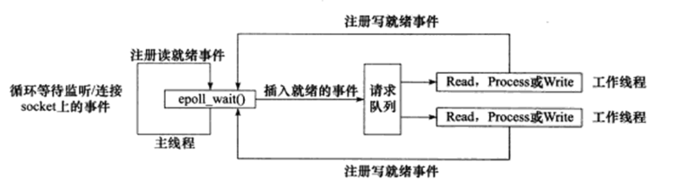
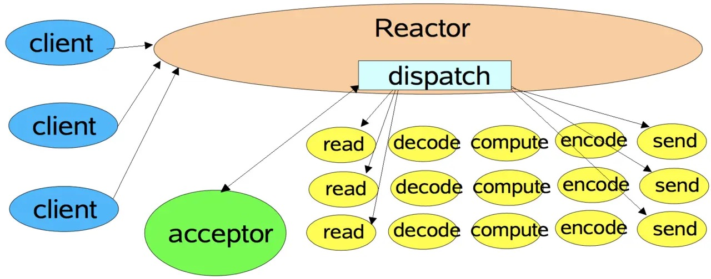
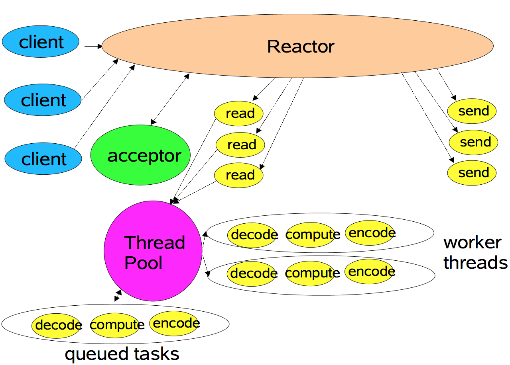
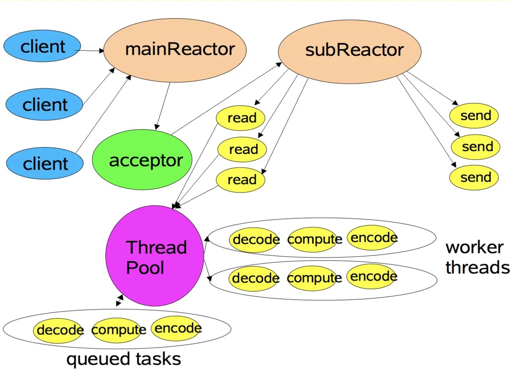
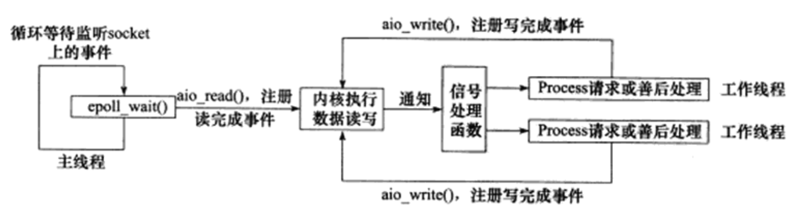
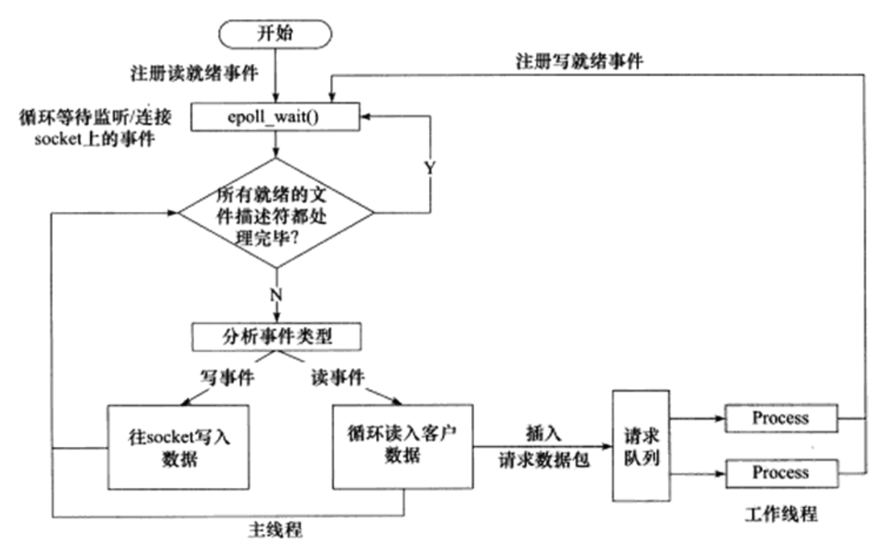

# Reactor

Reactor 是这样一种模式，它要求主线程（I/O处理单元）只负责监听文件描述上是否有事件发生，有的话就立即将该事件通知工作线程（逻辑单元）。除此之外，主线程不做任何其他实质性的工作。读写数据，接受新的连接，以及处理客户请求均在工作线程中完成。

使用同步I/O模型（以epoll_wait为例）实现的Reactor模式的工作流程：

1. 主线程往epoll内核时间表中注册socket上的读就绪事件。
2. 主线程调用epoll_wait等待socket上有数据可读。
3. 当socket上有数据可读时，epoll_wait通知主线程。主线程则将socket可读事件放入请求队列。
4. 睡眠在请求队列上的某个工作线程被唤醒，它从socket读取数据，并处理客户请求，然后往epoll内核事件表中注册该socket上的写就绪事件。
5. 主线程调用epoll_wait等待socket可写。
6. 当socket可写时，epoll_wait通知
7. 睡眠在请求队列上的某一个工作线程被唤醒，它往socket上写入服务器处理客户请求的结果。

## 单线程Reactor模式

## 工作者线程池

与单线程Reactor模式不同的是，添加了一个工作者线程池，并将非I/O操作从Reactor线程中移出转交给工作者线程池来执行。这样能够提高Reactor线程的I/O响应，不至于因为一些耗时的业务逻辑而延迟对后面I/O请求的处理。

## 多线程Reactor模式

Reactor线程池中的每一Reactor线程都会有自己的Selector、线程和分发的事件循环逻辑。
 mainReactor可以只有一个，但subReactor一般会有多个。mainReactor线程主要负责接收客户端的连接请求，然后将接收到的SocketChannel传递给subReactor，由subReactor来完成和客户端的通信。

## 优缺点

### 优点

解耦、提升复用性、模块化、可移植性、事件驱动、细力度的并发控制等

### 缺点

1. 相比传统的简单模型，Reactor增加了一定的复杂性，因而有一定的门槛，并且不易于调试。

2. Reactor模式需要底层的Synchronous Event Demultiplexer支持，比如Java中的Selector支持，操作系统的select系统调用支持，如果要自己实现Synchronous Event Demultiplexer可能不会有那么高效。
3. Reactor模式在IO读写数据时还是在同一个线程中实现的，即使使用多个Reactor机制的情况下，那些共享一个Reactor的Channel如果出现一个***长时间的数据读写***，会影响这个Reactor中其他Channel的相应时间，比如在大文件传输时，IO操作就会影响其他Client的相应时间。因而对这种操作，使用传统的***Thread-Per-Connection***或许是一个更好的选择，或则此时使用***Proactor***模式。

## 实例

- Netty
- Nginx
- libevent
- muduo

# Proactor

与Reactor模式不同，Proactor模式将所有I/O操作都交给主线程和内核来处理，工作线程仅仅负责业务逻辑。

使用异步I/O模型（以aio_read和aio_write为例）实现的Proactor模式的工作流程是：

1. 主线程调用aio_read函数向内核注册socket上的读完事件，并告诉内核用户读缓冲区的位置，以及读操作完成时如何通知应用程序（可以通过信号）
2. 主线程继续处理其他逻辑。
3. 当socket上的数据被读入用户缓冲区后，内核将向应用程序发送一个信号，已通知应用程序数据已经可以用了。
4. 应用程序预先定义好的信号处理函数选择一个工作线程来处理客户请求。工作线程处理完客户请求之后，调用aio_write函数向内核注册socket上的写完事件，并告诉内核用户写缓冲区的位置，以及写操作完成时如何通知应用程序
5. 主线程继续处理其他逻辑。
6. 当用户缓冲区的数据被写入socket之后，内核将向应用程序发送一个信号，已通知应用程序数据已经发送完毕。
7. 应用程序预先定义好的信号处理函数选择一个工作线程来做善后处理，比如决定是否关闭socket。

## 模拟Proactor

仅就Linux Posix支持的异步I/O接口而言，connect和accept是无法异步操作的，这时一般借用Reactor的机制去感知主动连接或者被动连接成功，再用这个套接字描述符发起异步操作。

使用同步IO方式模拟出Proactor模式：主线程执行数据读写操作，读写完成后，主线程向工作线程通知这一“完成事件”。那么从工作线程的角度来看，他们就直接获得了数据读写的结果，接下来就要做的知识多读写的结果进行逻辑处理。

使用同步I/O模型（以epoll_wait为例）模拟的Proactor模式的工作流程：

1. 主线程往epoll内核事件表中注册socket上的读就绪事件。
2. 主线程调用epoll_wait等待socket上有数据可读。
3. 当socket上有数据可读时，epoll_wait通知主线程。主线程从socket循环读取数据，知道没有更多数据可读，然后将读取到的数据封装成一个请求对象并插入请求队列。
4. 睡眠在请求队列上的某个工作线程被唤醒，它获得请求对象并处理客户请求，然后往epoll内核事件表中注册socket上的写就绪事件。
5. 主线程调用epoll_wait等待socket可写。
6. 当socket可写时，epoll_wait通知主线程。主线程往socket上写入服务器处理客户端请求的结果。

## 优缺点

### 优点

1. 将应用需要的异步机制同业务代码解耦，应用只需关心其专属服务。
2. 屏蔽下层操作系统支持异步I/O的细节，提供可移植性。
3. 应用程序不需要显示创建线程来提高并发性，因此将应用的线程策略和并发策略解耦。应用可以选择不同的事件完成分发器，比如既可以是单线程的也可以是线程池的。
4. 应用由于无需自己创建额外的控制线程，因此同步逻辑得以简化。
5. 性能提升。

### 缺点

调试困难，带有异步属性的程序共有的毛病。

## 实例

- IOCP
- Boost.Asio

# Reactor、Proactor区别

## 主动与被动

以主动写为例：

- Reactor将handle放到select()，等待可写就绪，然后调用write()写入数据；写完处理后续逻辑；
- Proactor调用aoi_write后立刻返回，由内核负责写操作，写完后调用相应的回调函数处理后续逻辑；

可以看出，Reactor***被动***地等待指示事件的到来并做出反应；它有一个等待的过程，做什么都要先放入到监听事件集合中等待handler可用时再进行操作；
Proactor直接调用***异步***读写操作，调用完后立刻返回；

## 实现

Reactor模式采用***同步***IO，而Proactor采用***异步***IO。

在Reactor中，事件分离器负责等待文件描述符或socket为读写操作准备就绪，然后将就绪事件传递给对应的处理器，最后由处理器负责完成实际的读写工作。

而在Proactor模式中，处理器–或者兼任处理器的事件分离器，***只负责发起异步读写操作***，***IO操作本身由操作系统来完成***。传递给操作系统的参数需要包括用户定义的数据缓冲区地址和数据大小，操作系统才能从中得到写出操作所需数据，或写入从socket读到的数据。事件分离器捕获IO操作完成事件，然后将事件传递给对应处理器。

## 优点

Reactor：

- 实现相对简单，对于***耗时短***的处理场景处理高效；

- 操作系统可以在多个事件源上等待，并且避免了多线程编程相关的性能开销和编程复杂性；
- 事件的串行化对应用是透明的，可以顺序的同步执行而不需要加锁；

- 事务分离：将与应用无关的多路分解和分配机制和与应用相关的回调函数分离开来，

Proactor：性能更高，能够处理***耗时长的并发场景；

## 缺点

Reactor处理耗时长的操作会造成事件分发的阻塞，影响到后续事件的处理；

Proactor实现逻辑复杂，依赖操作系统对异步的支持。目前实现了纯异步操作的操作系统少，实现优秀的如windows IOCP，但由于其windows系统用于服务器的局限性，目前应用范围较小；而Unix/Linux系统对纯异步的支持有限，应用事件驱动的主流还是通过select/epoll来实现；

## 适用场景

Reactor：同时接收多个服务请求，并且依次同步的处理它们的事件驱动程序；
Proactor：异步接收和同时处理多个服务请求的事件驱动程序；

# Actor

- [IO设计模式：Actor、Reactor、Proactor](https://www.cnblogs.com/losophy/p/9202815.html)
- [并发之痛 Thread，Goroutine，Actor]([http://itindex.net/detail/56342-%E5%B9%B6%E5%8F%91-thread-goroutine](http://itindex.net/detail/56342-并发-thread-goroutine))
- [【GoLang 那点事】深入浅出那些你知道但不理解的并发模型](https://learnku.com/articles/32807#d95484)

# 参考

- [Linux高性能服务器编程](https://book.douban.com/subject/24722611/)
- [Linux 的 IO 通信 以及 Reactor 线程模型浅析](https://zhuanlan.zhihu.com/p/35065251)

- [深入理解Reactor模式](https://www.s0nnet.com/archives/deep-understanding-of-reactor-design-patterns)
- [Proactor网络编程模式歪解](http://www.thinkingyu.com/articles/Proactor/)
- [高性能I/O设计模式概述](http://www.yeolar.com/note/2012/12/15/high-performance-io-design-patterns/)
- [Reactor模式论文](http://www.dre.vanderbilt.edu/~schmidt/PDF/reactor-siemens.pdf)
- [Proactor模式论文](http://www.dre.vanderbilt.edu/~schmidt/PDF/proactor.pdf)
- [Reactor模式详解](https://www.jianshu.com/p/541b0e4fd454)
- [IO设计模式：Reactor和Proactor对比](https://segmentfault.com/a/1190000002715832)