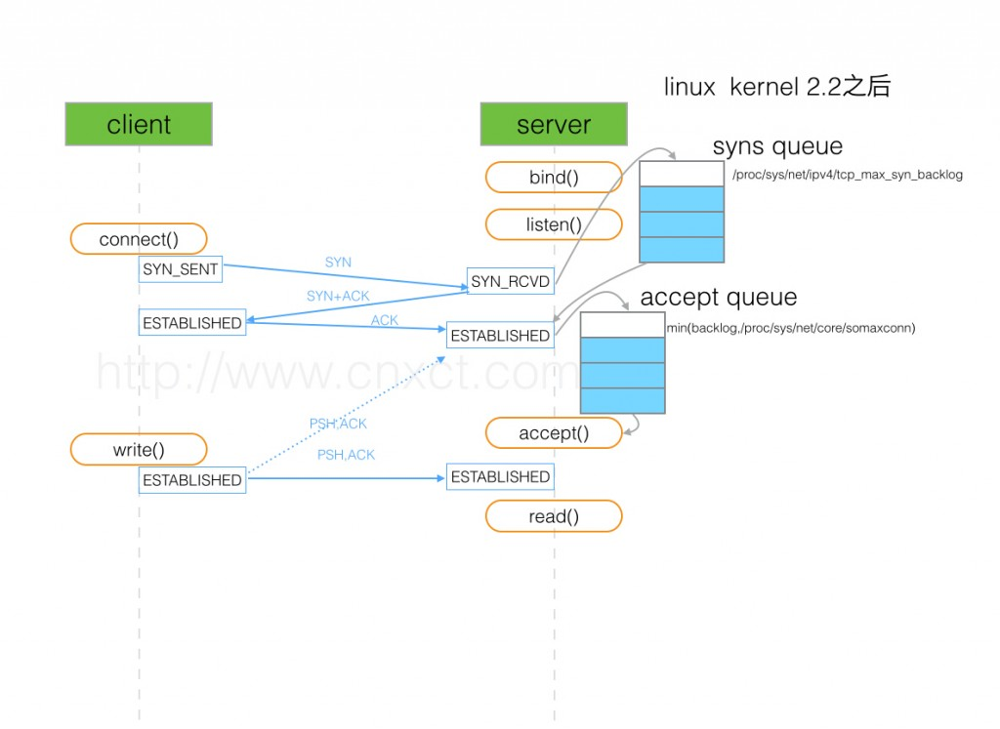

# Linux listen 函数 backlog 的含义

`listen`函数是网络编程中用来**使服务器端开始监听端口**的系统调用。

`listen`函数的定义：

```c++
LISTEN(2)                   BSD System Calls Manual                  LISTEN(2)

NAME
     listen -- listen for connections on a socket

SYNOPSIS
     #include <sys/socket.h>

     int
     listen(int socket, int backlog);

DESCRIPTION
     Creation of socket-based connections requires several operations.  First,
     a socket is created with socket(2).  Next, a willingness to accept incom-
     ing connections and a queue limit for incoming connections are specified
     with listen().  Finally, the connections are accepted with accept(2).
     The listen() call applies only to sockets of type SOCK_STREAM.

     The backlog parameter defines the maximum length for the queue of pending
     connections.  If a connection request arrives with the queue full, the
     client may receive an error with an indication of ECONNREFUSED.  Alterna-
     tively, if the underlying protocol supports retransmission, the request
     may be ignored so that retries may succeed.

RETURN VALUES
     The listen() function returns the value 0 if successful; otherwise the
     value -1 is returned and the global variable errno is set to indicate the
     error.
```

## 网上说法

1. Kernel 会为`LISTEN状态`的socket维护**一个队列**，其中存放`SYN RECEIVED`和`ESTABLISHED`状态的套接字，`backlog`就是这个队列的大小。
2. Kernel 会为`LISTEN状态`的socket维护**两个队列**，一个是`SYN RECEIVED`状态，另一个是`ESTABLISHED`状态，而`backlog`就是这两个队列的大小之和。
3. 第三种和第二种模型一样，但是`backlog`是队列`ESTABLISHED`的长度。

## 正确的解释

当一个应用使用`listen`系统调用让`socket`进入`LISTEN`状态时，它需要为该套接字指定一个`backlog`。`backlog`通常被描述为连接队列的限制。

由于TCP使用的3次握手，连接在到达`ESTABLISHED`状态之前经历中间状态`SYN RECEIVED`，并且可以由`accept`系统调用返回到应用程序。这意味着`TCP / IP`堆栈有两个选择来为`LISTEN`状态的套接字实现`backlog`队列：

（备注：一种就是两种状态在一个队列，一种是分别在一个队列）

1. 使用单个队列实现，其大小由`listen syscall`的`backlog`参数确定。 当收到`SYN`数据包时，它发送回`SYN/ACK`数据包，并将连接添加到队列。当接收到相应的`ACK`时，连接将其状态改变为已建立。 这意味着队列可以包含两种不同状态的连接：`SYN RECEIVED`和`ESTABLISHED`。 只有处于后一状态的连接才能通过`accept syscall`返回给应用程序。
2. 使用`两个队列`实现，一个`SYN`队列（或**半连接队列**）和一个`accept`队列（或**全连接队列**）。 处于`SYN RECEIVED`状态的连接被添加到`SYN`队列，并且当它们的状态改变为`ESTABLISHED`时，即当接收到3次握手中的`ACK`分组时，将它们移动到`accept`队列。 显而易见，`accept`系统调用只是简单地从完成队列中取出连接。 在这种情况下，`listen syscall`的backlog参数表示`完成队列`的大小。

历史上，[BSD](http://baike.baidu.com/item/BSD/3794498) 派生系统实现的`TCP`使用第一种方法。 该选择意味着当达到最大`backlog`时，系统将不再响应于`SYN分组`发送回`SYN/ACK`分组。 通常，`TCP`的实现将简单地丢弃`SYN分组`，使得客户端重试。

在**Linux**上，是和上面不同的。如在`listen`系统调用的手册中所提到的：

在Linux内核2.2之后，`socket backlog`参数的形为改变了，**现在它指等待`accept`的`完全建立`的套接字的队列长度**，而不是不完全连接请求的数量。 **不完全连接**的长度可以使用`/proc/sys/net/ipv4/tcp_max_syn_backlog`设置。

这意味着当前Linux版本使用上面第二种说法，有**两个队列**：具有由系统范围设置指定的大小的`SYN队列` 和 应用程序（也就是backlog参数）指定的`accept`队列。



## 如果`accept`队列满了，可是有连接需要从`SYN`队列转移过来时会发生什么？

总而言之，如果`Linux`中的`TCP`接收到3次握手的`ACK数据包`，并且接受队列已满，它将基本上忽略该数据包。 这听起来很奇怪，但是记住**有一个与SYN RECEIVED状态相关联的定时器**：如果没有收到`ACK`分组（在这里我们考虑的情况是ACK被忽略，就和没有收到是一样的），则`TCP`将重新发送 `SYN/ACK`数据包（由`/proc/sys/net/ipv4/tcp_synack_retries`指定次数）。

[How TCP backlog works in Linux](http://veithen.io/2014/01/01/how-tcp-backlog-works-in-linux.html)提到：

> What this means is that if the accept queue is full, then the kernel will impose a limit on the rate at which SYN packets are accepted. If too many SYN packets are received, some of them will be dropped. In this case, it is up to the client to retry sending the SYN packet and we end up with the same behavior as in BSD derived implementations.

- [TCP 半连接队列和全连接队列满了会发生什么？又该如何应对？](https://juejin.im/post/5ed26eba6fb9a047ea45d4f3?utm_source=gold_browser_extension)

## 参考

- [深入探索 Linux listen() 函数 backlog 的含义](https://blog.csdn.net/yangbodong22011/article/details/60399728)
- [Linux 网络半链接、链接队列](https://jin-yang.github.io/post/network-synack-queue.html)
- [TCP SOCKET中backlog参数的用途是什么？ ---图解](https://www.cnblogs.com/zengkefu/p/5602396.html)
- [Socket accept queue is full  但是一个连接需要从SYN->ACCEPT](https://blog.csdn.net/yangbodong22011/article/details/60468820)
- [TCP 半连接队列与全连接队列](https://my.oschina.net/HY1024/blog/1632386)
- [How TCP backlog works in Linux](http://veithen.io/2014/01/01/how-tcp-backlog-works-in-linux.html)
- [TCP queue 的一些问题](http://jaseywang.me/2014/07/20/tcp-queue-%E7%9A%84%E4%B8%80%E4%BA%9B%E9%97%AE%E9%A2%98/)