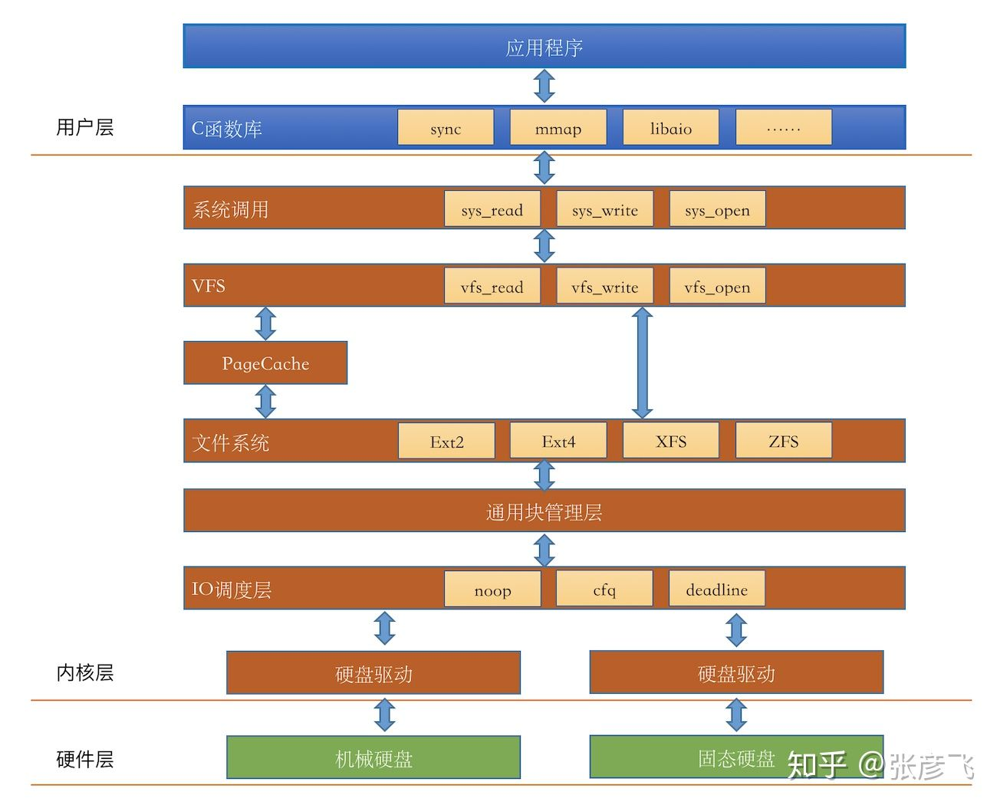

# IO

IO 相关知识

## IO栈

- [read文件一个字节实际会发生多大的磁盘IO？](https://zhuanlan.zhihu.com/p/138371910)

## read

read总是在接收缓冲区有数据时立即返回，而不是等到给定的read buffer填满时返回。返回值就是读取的字节数，同时内核receivebuffer空间会增加相应的大小。只有当receive buffer为空时，阻塞模式才会等待，而nonblock模式下会立即返回-1（errno = EAGAIN或EWOULDBLOCK）。

阻塞模式下，提前返回：

1. 读常规文件时，在读到count个字节之前已到达文件末尾。例如，距文件末尾还有30个字节而请求读100个字节，则read返回30，下次read将返回0。
2. 从终端设备读，通常以行为单位，读到换行符就返回了。
3. 从网络读，根据不同的传输层协议和内核缓存机制，返回值可能小于请求的字节数。
4. 在读入部分数据时，被信号打断，返回已经读到的数据

- [read/write函数与（非）阻塞I/O的概念](https://www.cnblogs.com/alantu2018/p/8472736.html)
- [write和read返回值详解](https://blog.csdn.net/songchuwang1868/article/details/90665865)