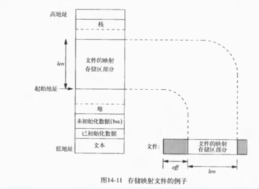
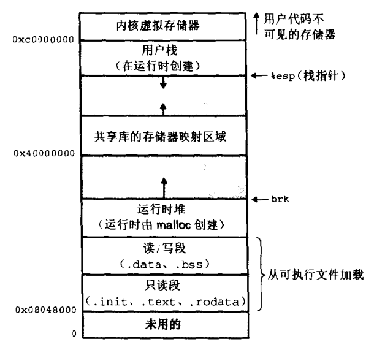

# 共享内存

采用共享内存通信的一个显而易见的好处是效率高，因为进程可以直接读写内存，而不需要任何数据的拷贝。对于像管道和消息队列等通信方式，则需要在内核和用户空间进行四次的数据拷贝，而共享内存则只拷贝两次数据：一次从输入文件到共享内存区，另一次从共享内存区到输出文件。

共享内存有：

- mmap()
- POSIX 共享内存
- System V 共享内存

# 共享内存的位置

在`/proc/sys/kernel/`目录下，记录着共享内存的一些限制，如一个共享内存区的最大字节数`shmmax`，系统范围内最大共享内存区标识符数`shmmni`等，可以手工对其调整，但不推荐这样做。

```shell
sysctl kernel.shmall  //可以查看共享内存的大小
```

共享内存存在于进程数据段（？），如下图：





# 参考

- [共享内存](https://michaelyou.github.io/2015/03/04/%E5%85%B1%E4%BA%AB%E5%86%85%E5%AD%98/?nsukey=qXvJGauylaJdeWLM%2FwswdHQbOLWZp6shLgalqFoHXPkUEwNYryWr%2FySSu1OIID4evlMlFMb3JA9RX%2FCn6IrzS3iNoTUMZ%2BSVUT90Wbocv5FktcQq%2FKf9VVtqB0gNEWp0aawfblo74qw4%2BH6%2ByIJWZw%3D%3D)
- [system v和posix的共享内存对比 & 共享内存位置](https://www.cnblogs.com/charlesblc/p/6261469.html)

- [进程间通信之-共享内存Shared Memory--linux内核剖析（十一）](https://blog.csdn.net/gatieme/article/details/51005811)

